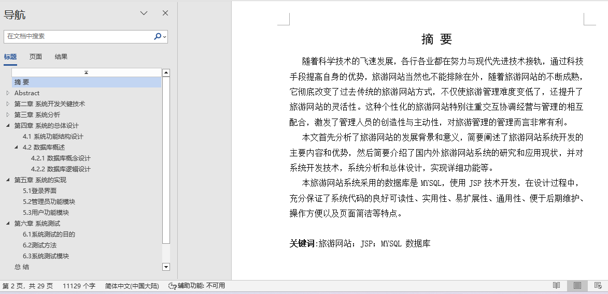
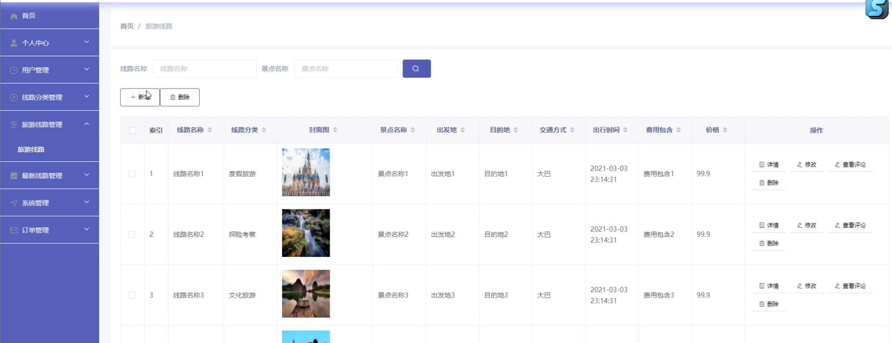
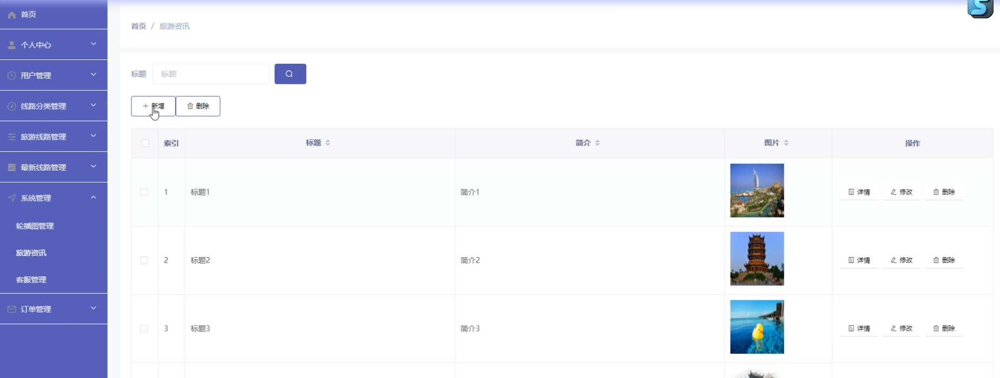
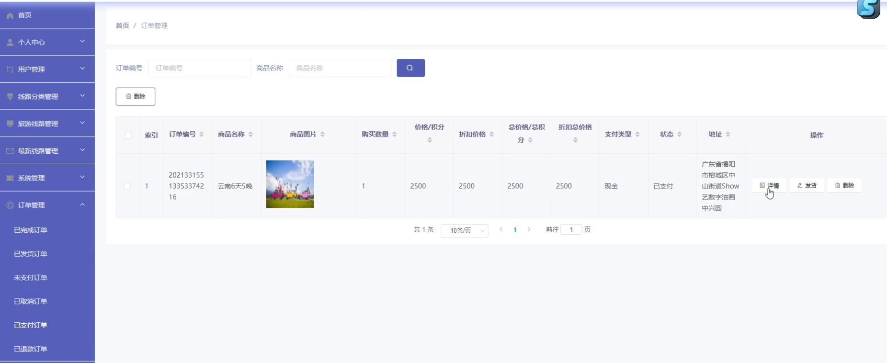
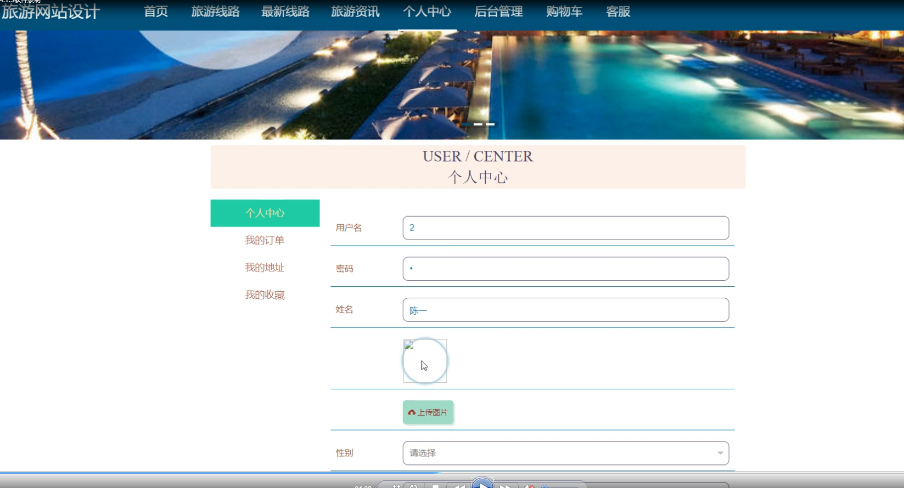
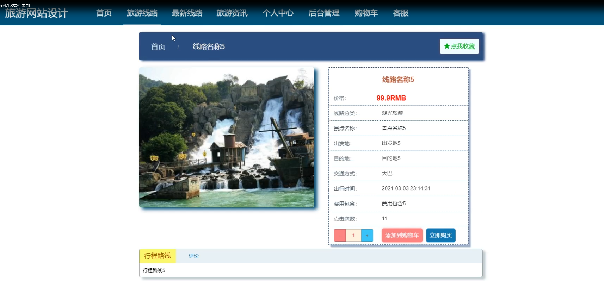

## 基于SpringBoot的旅游网站(程序+报告)

###  获取sql数据库文件: 从戎源码网 (https://armycodes.com/) QQ: 386869957 QQ群: 377586148
###  所有系统地址: (https://github.com/YuLin-Coder/AllProjectCatalog) 
###  所有项目以及源代码本人均调试运行无问题 可支持远程安装部署调试、定制修改、代码讲解

## 项目介绍
基于SpringBoot的旅游网站，系统包含两种角色：用户、管理员，系统分为前台和后台两大模块，主要功能如下：

### 【管理员】:
1. 管理员登录界面:
   - 管理员需通过正确的账号、密码进行登录操作。

2. 用户管理界面:
   - 管理员可查看、添加、修改、删除用户信息。

3. 商品信息管理界面:
   - 管理员可增删改查商品信息。

4. 团购信息管理界面:
   - 管理员可添加、修改和删除团购信息。

5. 订单管理界面:
   - 管理员可查看所有订单信息，并对未发货订单进行发货操作。

### 【用户】:
1. 用户注册界面:
   - 用户可进行注册操作。

2. 用户登录界面:
   - 用户需登录后才能进行商品购买等操作。

3. 系统主界面:
   - 用户可查看系统信息，包括首页、商品信息、团购信息等。

4. 商品详情界面:
   - 用户可查看商品详情，并进行收藏、加入购物车和购买操作。

5. 购物车界面:
   - 用户可查看购物车商品信息，并进行修改数量、删除商品及购买操作。

6. 我的订单界面:
   - 用户可查看个人订单信息。

7. 团购详情界面:
   - 用户可查看团购详情，并进行加入购物车、购买或收藏操作。

## 项目技术
- 编程语言：Java
- 数据库：MySQL
- 项目管理工具：Maven
- 前端技术：HTML、CSS、JavaScript、Jquery、Vue
- 后端技术：Spring、SpringMVC、MyBatis

## 运行环境
- JDK版本：JDK1.8及以上
- 开发工具：IDEA、Ecplise、Myecplise都可以
- 数据库: MySQL5.7及以上
- Maven：maven3.0及以上
- Node：14.14.0及以上

## 运行截图

